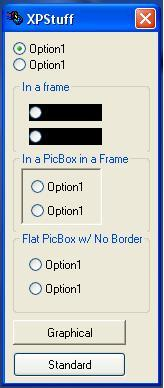



## XP Style Control Help

### Description

I wanted to share what i have learned about supporting XP themes in your existing apps. Note that the themes will only be visible if you are running Windows XP. Any other OS and they will look as they did before. First, make a manifest file for your app. This is fairly simple and samples can be searched for at PSC (go to http://www.planet-source-code.com/xq/ASP/txtCodeId.27928/lngWId.1/qx/vb/scripts/ShowCode.htm and that code will generate one for you). The second thing i learned is that certain controls, especially the option button, will not show up correctly in a frame(ie ugly black box around the option control). This can be resolved by putting your control in a picture box inside the frame. Second, a command button that is set to graphical style will not show up themed. The button has to be a standard style. Note that this property cannot be set through code, it has to de done via the properties in the IDE. Hope this helps.
 
### More Info
 
I think by default if you use a manifest file then your app is setup to be in Windows 2000 compatibilty mode. I have not tested this fully though.

             |
---                |---
**Submitted On**   |2001-12-20 20:58:10
**By**             |[El Mariachi](https://github.com/Planet-Source-Code/PSCIndex/blob/master/ByAuthor/el-mariachi.md)
**Level**          |Beginner
**User Rating**    |4.2 (21 globes from 5 users)
**Compatibility**  |VB 5\.0, VB 6\.0
**Category**       |[Custom Controls/ Forms/  Menus](https://github.com/Planet-Source-Code/PSCIndex/blob/master/ByCategory/custom-controls-forms-menus__1-4.md)
**World**          |[Visual Basic](https://github.com/Planet-Source-Code/PSCIndex/blob/master/ByWorld/visual-basic.md)
**Archive File**   |[XP\_Style\_C4331912202001\.zip](https://github.com/Planet-Source-Code/el-mariachi-xp-style-control-help__1-29997/archive/master.zip)

